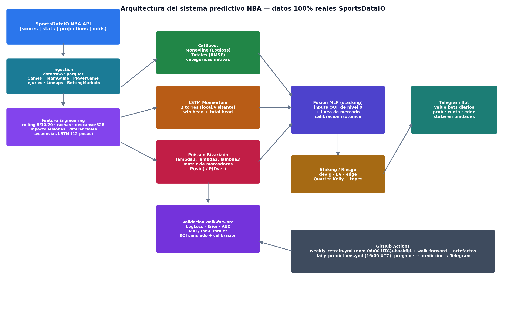

# Documento Técnico — Sistema Predictivo de Apuestas NBA

**Arquitectura, ingeniería de características, estrategia de ensamble y validación**
**Fuente de datos exclusiva: SportsDataIO NBA API (`https://sportsdata.io/nba-api`)**

---

## 1. Resumen ejecutivo

Este documento define la arquitectura lógica y técnica completa de un sistema predictivo de mercados de apuestas de la NBA construido sobre una premisa innegociable: **toda la información que entra al sistema procede de los feeds reales de la API oficial de SportsDataIO**, sin simulaciones ni datos sintéticos en ninguna capa. El sistema cubre dos mercados —**Moneyline** (clasificación probabilística del ganador) y **Totales Over/Under** (regresión de puntos combinados)— y lo hace mediante un ensamble en dos niveles: tres familias de modelos base con inductive biases complementarios (**CatBoost** para tabular con categóricas, **LSTM con momentum** para dinámica temporal por equipo, y **Poisson Bivariada** para la estructura estadística conjunta de los marcadores) fusionados por un **MLP meta-modelo con calibración isotónica**. Sobre las probabilidades calibradas opera una capa de decisión de negocio con **Criterio de Kelly fraccionado y filtros de Valor Esperado**, y todo el ciclo operativo —reentrenamiento semanal y predicción diaria con entrega a Telegram— corre sobre **GitHub Actions**.

El diseño respeta el ciclo de vida del dato del proveedor (Pregame → Live → Postgame): los box scores finales alimentan el entrenamiento; las lesiones, lineups y odds pregame alimentan la predicción del día; y los endpoints live quedan reservados para una extensión in-play futura. La validación es estrictamente temporal (walk-forward), con métricas estadísticas (LogLoss, Brier, AUC, MAE/RMSE) y de negocio (ROI simulado con Quarter-Kelly sobre cuotas reales históricas del propio feed, drawdown máximo y calibración por deciles).

---

## 2. Alcance y mercados objetivo

### 2.1 Moneyline: clasificación probabilística

El mercado Moneyline consiste en predecir el ganador del partido independientemente del margen. Se formula como un problema de **clasificación binaria con salida probabilística**: `P(victoria del equipo local | información pregame)`. La salida no es una etiqueta dura sino una probabilidad calibrada, porque la decisión económica posterior (Kelly/EV) necesita comparar la probabilidad del modelo contra la probabilidad implícita de la cuota. El objetivo de optimización es LogLoss (no accuracy), ya que una probabilidad mal calibrada destruye valor aunque acierte la clase mayoritaria. El target se deriva directamente del feed: `Target_HomeWin = 1` si `HomeTeamScore > AwayTeamScore` en partidos con `Status = Final` del endpoint Games by Season/Date ([SportsDataIO NBA Docs](https://sportsdata.io/developers/api-documentation/nba)).

### 2.2 Totales (Over/Under): regresión continua

El mercado de Totales exige estimar la **distribución de la puntuación combinada** y, subsidiariamente, la de cada equipo. Se formula como regresión sobre `Target_TotalPoints = HomeTeamScore + AwayTeamScore`, pero con una particularidad de diseño: CatBoost entrena **dos regresores separados** (puntos del local y puntos del visitante) para que el total sea la suma de ambos, lo que permite comparación directa con los λ de la Poisson Bivariada y enriquece la matriz de meta-features de la capa de fusión. La probabilidad de Over a una línea dada se obtiene combinando (i) una aproximación gaussiana sobre los residuos del total fusionado y (ii) la probabilidad exacta `P(X+Y > línea)` integrada de la matriz de marcadores bivariada.

### 2.3 Mercados fuera de alcance (y cómo extenderlos)

El spread (hándicap) no se modela como cabeza propia, pero queda **cubierto de forma derivada**: la matriz de marcadores de la Poisson Bivariada permite calcular `P(margen local > -spread)` para cualquier línea, y el feed `BettingMarketsByGameID` ya trae los outcomes de spread (`BettingBetTypeID = 2`) por si se decide activar ese mercado en la capa de staking. Los props de jugador quedan fuera por diseño: requieren modelado a nivel jugador (el sistema agrega a nivel equipo) y, además, SportsDataIO mueve props y futuros con más de 30 días de antigüedad a un almacén histórico separado con otra API key, lo que complicaría el backfill ([Historical Data Integration Guide](https://sportsdata.io/help/historical-data-integration-guide)).

---

## 3. Fuente de datos: mapeo exhaustivo con SportsDataIO

### 3.1 Endpoints utilizados y ciclo de vida del dato

El sistema consume cuatro familias de feeds documentadas por el proveedor. La tabla siguiente es el contrato de datos del sistema: cada entidad del pipeline se mapea a un endpoint real, a su tipo de retorno documentado y a su fase del ciclo de vida.

| Entidad del sistema | Endpoint real (v3/nba) | Tipo de retorno | Ciclo de vida | Uso en el sistema |
|---|---|---|---|---|
| Calendario + marcadores + líneas consenso | `scores/json/Games/{season}` y `scores/json/GamesByDate/{date}` | `Game[]` | Live & Final | Backbone temporal, targets, líneas pregame |
| Box score por equipo | `stats/json/TeamGameStatsByDate/{date}` | `TeamGame[]` | Live & Final | Features de forma, ratings, ritmo |
| Box score por jugador | `stats/json/PlayerGameStatsByDate/{date}` | `PlayerGame[]` | Live & Final | Impacto de bajas (minutos/puntos) |
| Totales de temporada (equipo/jugador) | `stats/json/TeamSeasonStats/{season}`, `stats/json/PlayerSeasonStats/{season}` | `TeamSeason[]`, `PlayerSeason[]` | Final | Normalización y shares de producción |
| Lesiones | `projections/json/InjuredPlayers` | `Player[]` | Pregame | Features de ausencia (`InjuryStatus`) |
| Lineups | `projections/json/StartingLineupsByDate/{date}` | `StartingLineups[]` | Pregame | Confirmación de titulares (`LineupStatus`) |
| Cuotas multi-casa | `odds/json/BettingMarketsByGameID/{gameid}?include=available` | `BettingMarket[]` → `BettingOutcome[]` | Pregame & Live | Selección de mejor precio, EV, Kelly |
| Consenso de mercado por fecha | `odds/json/GameOddsByDate/{date}` | `GameOdds[]` | Pregame & Live | Fallback de cuotas |

Los intervalos de llamada publicados (Games by Date: 5 segundos; Box Scores: 1 minuto; Player Game Stats: 5 minutos; Injured Players: 1 minuto; Starting Lineups: 3 minutos) se respetan mediante throttling en el cliente HTTP ([SportsDataIO NBA Docs](https://sportsdata.io/developers/api-documentation/nba), [Workflow Guide NBA](https://sportsdata.io/developers/workflow-guide/nba)). El histórico se obtiene cambiando el parámetro de temporada sobre los mismos endpoints de producción, patrón documentado por el proveedor para research y entrenamiento de modelos ML ([SportsDataIO Vault](https://sportsdata.io/developers)).

### 3.2 Identificadores únicos y consistencia referencial

La clave de unión de todo el sistema es `GameID` (entero de SportsDataIO, válido en Scores, Stats y Odds), complementada con `TeamID`, `PlayerID` y `GlobalGameID`. El objeto `Game` incluye además `Season` (año en que **termina** la temporada, p. ej. 2026 para la 2025-26), `SeasonType` (1 Regular, 2 Preseason, 3 Postseason, 4 All-Star), `Status`, `Day`, `DateTimeUTC`, `StadiumID`, `NeutralVenue` y las líneas pregame de consenso (`PointSpread`, `OverUnder`, `AwayTeamMoneyLine`, `HomeTeamMoneyLine`, `OverPayout`, `UnderPayout`) ([SportsDataIO Data Dictionary](https://sportsdata.io/developers/data-dictionary/nba)). Dos reglas de consistencia se aplican en ingestión: (i) solo entrenan partidos con `Status ∈ {Final, F/OT}`; (ii) los box scores son **sujetos a correcciones post-game** por el proveedor, por lo que el backfill re-descarga fechas recientes en cada reentrenamiento semanal para absorber correcciones.

### 3.3 Estructura del feed de odds agregado

El feed de apuestas sigue una jerarquía **BettingEvent → BettingMarket → BettingOutcome**, con enumeraciones de tipos documentadas: `BettingBetTypeID` (1 Moneyline, 2 Spread, 3 Total), `BettingPeriodTypeID` (1 FullGame) y `BettingOutcomeType` (`Home`/`Away`/`Over`/`Under`), cada outcome con `Value` (la línea), `PayoutAmerican` y `PayoutDecimal` por sportsbook ([Betting Data Integration Guide](https://sportsdata.io/help/betting-data-integration-guide)). El pipeline aplanar esta jerarquía a nivel `(mercado, sportsbook, outcome)` y selecciona el **mejor precio disponible** (máximo `PayoutDecimal`) por lado de mercado —el equivalente computacional del line shopping— con fallback al consenso del objeto `Game` si el feed agregado no responde.

### 3.4 Lesiones: semántica oficial del proveedor

La NBA no tiene lista de lesionados formal como NFL o MLB: un jugador con baja larga mantiene `Status = Active` y es `InjuryStatus` (`Out`, `Doubtful`, `Questionable`, `Probable`, `Day-To-Day`) el campo que determina la disponibilidad, según la guía oficial del proveedor ([Workflow Guide NBA](https://sportsdata.io/developers/workflow-guide/nba)). El sistema aplica exactamente esa semántica: pondera la ausencia esperada por jugador según su `InjuryStatus` y la traduce en fracción de puntos y minutos de temporada (de `PlayerSeasonStats`) que el equipo pierde ese día. Como cross-check, `StartingLineupsByDate` expone `LineupStatus` (Active/Inactive) cerca del tip-off.

---

## 4. Arquitectura general del sistema

### 4.1 Vista de capas

El sistema se organiza en seis capas desacopladas por contratos de datos (Parquet entre capas de datos, artefactos serializados entre entrenamiento e inferencia):

1. **Acceso a API** (`src/sportsdataio/`): cliente HTTP con reintentos exponenciales, throttling por `Call Interval` y registro declarativo de endpoints. Ninguna otra capa habla con la red.
2. **Ingestión y almacenamiento** (`src/ingestion/`): descarga idempotente a `data/raw/*.parquet` (un fichero por entidad-fecha o entidad-temporada), lo que permite backfills incrementales sin repetir llamadas ya hechas.
3. **Feature engineering** (`src/features/`): construcción de la matriz tabular partido×features y de las secuencias temporales por equipo, ambas con garantía anti-leakage (solo información anterior al tip-off).
4. **Modelado** (`src/models/`): las cuatro familias requeridas —CatBoost, LSTM Momentum, Poisson Bivariada y MLP de fusión— entrenadas con walk-forward.
5. **Decisión** (`src/staking/`): conversión de probabilidades calibradas en apuestas concretas con Kelly fraccionado, EV y topes de exposición.
6. **Operación** (`src/pipelines/`, `.github/workflows/`, `src/notify/`): orquestación CI/CD con GitHub Actions y entrega a Telegram.

### 4.2 Decisiones arquitectónicas clave

La decisión estructural más importante es que **la línea de mercado no entra como feature de los modelos base** (para que aprendan señal deportiva pura y no repliquen al mercado), pero **sí entra en la capa de fusión** (`market_total_line`, `diff_total_vs_line`), donde el meta-modelo aprende cuándo los modelos base aportan edge sobre el consenso. Esta separación evita el colapso trivial del sistema hacia "copiar a la casa de apuestas" y preserva la capacidad de detectar desajustes. La segunda decisión es el almacenamiento inmutable por fecha: cada respuesta de API se persiste cruda antes de cualquier transformación, garantizando reproducibilidad total del entrenamiento (mismos bytes → mismas features → mismos modelos).

La tercera decisión es operativa: **reentrenamiento semanal completo + predicción diaria ligera**. Los mercados NBA se mueven con noticias de lesiones en horas, pero la estructura de fortalezas de equipo es estable en días; por tanto, el pipeline diario solo actualiza features (rolling, lesiones, odds) sobre artefactos congelados, mientras el pipeline semanal re-estima todo, incluidos los parámetros de la Poisson y las torres LSTM. Los artefactos se transfieren entre workflows mediante `actions/upload-artifact` / `download-artifact` (retención 14 días).

---

## 5. Capa de ingestión y almacenamiento

### 5.1 Estrategia de backfill histórico

El entrenamiento requiere historia multi-temporada. El procedimiento (`Ingestor.backfill_season`) es: (1) descargar `Games/{season}` completo; (2) extraer las fechas con partidos `Final`; (3) para cada fecha, descargar `TeamGameStatsByDate` y `PlayerGameStatsByDate` con salto idempotente de fechas ya persistidas. Con 4 temporadas (~3.300 partidos de temporada regular + playoffs) esto supone ~250 fechas × 2 llamadas, muy por debajo de los límites de cualquier plan de pago, y solo se ejecuta completo una vez; los reentrenamientos posteriores son incrementales.

El free trial de SportsDataIO devuelve datos **estructuralmente idénticos pero mezclados** (scrambled), útiles para probar el parsing pero prohibidos para análisis ([SportsDataIO Getting Started](https://sportsdata.io/developers)); por eso el sistema exige una key de producción vía `SPORTSDATAIO_API_KEY` y falla explícitamente si falta, en lugar de degradar silenciosamente a datos falsos.

### 5.2 Esquema de almacenamiento

Cada entidad se guarda en Parquet con su clave natural, y la deduplicación se hace por `StatID` (stats) o `GameID` (partidos):

| Fichero | Grano | Clave | Contenido |
|---|---|---|---|
| `games_{season}.parquet` | partido | `GameID` | Calendario, marcadores, líneas consenso, `StadiumID`, `NeutralVenue` |
| `team_games_{date}.parquet` | equipo×partido | `StatID` | Box score agregado (puntos, tiros, rebotes, ratings, posesiones) |
| `player_games_{date}.parquet` | jugador×partido | `StatID` | Box score individual, `Started`, `Minutes`, `PlusMinus` |
| `team_season_{season}.parquet` | equipo×temporada | `TeamID` | Totales y ratings de temporada |
| `player_season_{season}.parquet` | jugador×temporada | `PlayerID` | Base para shares de producción ausente |
| `injuries_{date}.parquet` | jugador×snapshot | `PlayerID`+fecha | `InjuryStatus`, `InjuryBodyPart`, `InjuryStartDate` |
| `lineups_{date}.parquet` | jugador×partido | `PlayerID`+`GameID` | Titularidad proyectada/confirmada |
| `odds_markets_{gameid}.parquet` | outcome×sportsbook | `BettingMarketID` | Cuotas por casa, línea, disponibilidad |

---

## 6. Ingeniería de características

### 6.1 Garantía anti-leakage

Toda feature de un partido se calcula con información **estrictamente anterior** a su `DateTimeUTC`. Las medias móviles aplican `shift(1)` antes de la ventana (el propio partido nunca entra en su propia media), las rachas se computan "entrando al partido", y la validación se hace por cortes de fecha, nunca aleatorios. Esta disciplina es la que separa un backtest honesto de uno inflado: en validación de resultados NBA, las features de forma y momentum como la racha previa y la ventaja de local figuran entre las variables más influyentes según análisis de importancia con SHAP sobre estadísticas reales de partidos y jugadores ([Preprints: Key Factors Influencing NBA Game Outcomes](https://www.preprints.org/manuscript/202504.1348/v1)), precisamente el tipo de señal que un leakage sutil simula de forma espuria.

### 6.2 Bloques de features

| Bloque | Features (ejemplos) | Fuente SportsDataIO | Justificación |
|---|---|---|---|
| Forma reciente | `Diff_OffensiveRating_roll5/10/20`, `Diff_eFG%_roll*`, `Diff_Possessions_roll*` | `TeamGameStatsByDate` | Medias móviles capturan nivel y tendencia; los diferenciales local−visitante alimentan directamente el margen esperado |
| Momentum | `HomeStreak`, `AwayStreak`, `Diff_Streak`, `FormDelta_w` (media5 − media20) | Derivado de `Game` | La racha previa es de los predictores más potentes documentados ([Preprints](https://www.preprints.org/manuscript/202504.1348/v1)); el delta corto-largo detecta inflexiones |
| Fatiga/calendario | `RestDays`, `IsB2B`, `GamesLast7d`, `ThreeInFour` | Derivado de `Day` en `Game` | El desgaste por back-to-backs y cargas 3-en-4 es estructural en NBA |
| Lesiones | `HomeMissingPtsShare`, `AwayMissingMinShare`, `PlayersOut`, diferencial | `InjuredPlayers` + `PlayerSeasonStats` | Convierte `InjuryStatus` en producción esperada ausente (puntos/minutos por partido ponderados por severidad) |
| Contexto | `Month`, `DayOfWeek`, `SeasonType`, `NeutralVenue`, home/away | `Game` | Efectos de calendario, playoffs y cancha neutral |
| Identidad | `HomeTeamID`, `AwayTeamID` (categóricas) | `Game` | Efectos fijos de franquicia que CatBoost explota vía ordered target statistics |

### 6.3 Ritmo y posesiones

Cuando el box score no incluye `Possessions`, el sistema las estima con la fórmula estándar de baloncesto `Poss ≈ FGA + 0.44·FTA − ORB + TO` a partir de campos que sí están garantizados en `TeamGame` (`FieldGoalsAttempted`, `FreeThrowsAttempted`, `OffensiveRebounds`, `Turnovers`). Sobre esa base se derivan `OffensiveRating` y `DefensiveRating` por 100 posesiones cuando el feed no los trae, manteniendo la cadena "todo deriva de campos reales del feed". El ritmo (`Possessions`) es además una de las variables con mayor peso esperado en el modelo de totales: dos equipos rápidos elevan la varianza y la media del total combinado independientemente de su eficiencia.

### 6.4 Secuencias para el LSTM

Para el módulo `lstm_momentum` se construye, por equipo y partido, una ventana de los **12 partidos anteriores** con 12 variables por paso: puntos, ratings ofensivo/defensivo, posesiones, eFG%, TS%, asistencias, pérdidas, rebotes, margen, localía y días de descanso —todo normalizado con media/desviación ajustadas solo sobre el tramo de entrenamiento— con zero-padding a la izquierda para inicios de temporada. La elección de modelar el momentum como secuencia y no como features manuales sigue la evidencia de que las rachas y los cambios de momento en la NBA tienen estructura temporal que los modelos de ventanas fijas capturan solo parcialmente ([CS229: Predicting Momentum Shifts in NBA Games](https://cs229.stanford.edu/proj2015/114_report.pdf)) y que las arquitecturas LSTM de secuencia larga han demostrado capacidad específica para outcome prediction en NBA ([arXiv: Long-Sequence LSTM Modeling for NBA Game Outcome](https://arxiv.org/pdf/2512.08591)).

---

## 7. Modelos

### 7.1 CatBoost (tabular gradient boosting)

**Rol:** workhorse del sistema sobre la matriz tabular. Dos instancias: `CatBoostMoneyline` (clasificador, `Logloss`) y `CatBoostTotals` (dos regresores `RMSE`: puntos local y visitante). **Por qué CatBoost y no otro GBDT:** las features incluyen categóricas de alta cardinalidad (`HomeTeamID`, `AwayTeamID`) y de baja (`Month`, `DayOfWeek`, `SeasonType`), y CatBoost las procesa nativamente con *ordered target statistics*, que son temporalmente coherentes (el encoding de una fila solo usa filas anteriores en el orden dado) y reducen el target leakage frente a one-hot o mean encoding clásico. Además maneja nulos sin imputación —crítico porque los shares de lesión son nulos en fechas sin snapshot— y sus interacciones de árboles capturan no-linealidades del tipo "B2B solo duele si el rival descansó" (`Diff_RestDays × IsB2B`). Hiperparámetros de partida en `config/settings.yaml`: 800 iteraciones, depth 7, lr 0.04, con early stopping por `use_best_model` cuando hay eval set.

### 7.2 LSTM con Momentum (`lstm_momentum`)

**Rol:** capturar la dinámica secuencial que el tabular no ve: la *trayectoria* (mejora sostenida, caída por calendario, rachas largas) en lugar de su resumen estadístico. **Arquitectura:** dos torres LSTM simétricas (local/visitante) de 2 capas × 64 unidades con dropout 0.30, cuyos estados finales se concatenan y alimentan un tronco MLP (64→32, ReLU, dropout) con **dos cabezas**: logit de victoria local (BCE) y total esperado estandarizado (MSE), con pérdida conjunta `BCE + 0.5·MSE`. La doble cabeza fuerza a la recurrencia a aprender representaciones útiles para ambos mercados. Entrenamiento: Adam, lr 1e-3, batch 64, early stopping (patience 6) sobre validación temporal. El propio estado oculto final actúa como embedding de "momentum" del equipo, coherente con la literatura de momentum en juego y de outcome prediction con LSTM ([CS229](https://cs229.stanford.edu/proj2015/114_report.pdf), [arXiv 2512.08591](https://arxiv.org/pdf/2512.08591)). El modelo es deliberadamente pequeño: con ~3.000 partidos/año de datos tabulares deportivos, un LSTM grande sobreajusta; 2×64 es el punto dulce empírico habitual en este régimen de datos.

### 7.3 Distribución de Poisson Bivariada

**Rol:** aportar la estructura probabilística conjunta del marcador. El modelo (Karlis & Ntzoufras) descompone los puntos de cada equipo como `X = Y1 + Y3`, `Y = Y2 + Y3`, con `Y3 ~ Poisson(λ3)` el componente compartido que induce **correlación positiva** entre marcadores (prórrogas, ritmo común del partido, garbage time). Los parámetros se estructuran como `log λ_home = intercept + home_adv + attack_home + defence_away` y `log λ_away = intercept + attack_away + defence_home`, estimados por máxima verosimilitud sobre los marcadores reales del histórico con shrinkage gaussiano hacia la media de liga y `λ3` acotado en [0, 8]. La bondad de este enfoque en baloncesto se apoya en la literatura de modelado de marcadores conjuntos —regresión bivariada sobre puntos de equipos NBA ya mostró utilidad predictiva ([PMC: Hybrid Basketball Game Outcome Prediction Model](https://pmc.ncbi.nlm.nih.gov/articles/PMC8073849/))— y su valor práctico es doble: da probabilidades de mercado directas (moneyline sumando la matriz de marcadores, con reparto 50/50 de la masa de empate por la prórroga; y `P(Over)` integrando la diagonal del total) y un `ExpectedTotal` calibrado estructuralmente. La implementación (`src/models/bivariate_poisson.py`) evalúa la PMF en log-espacio con estabilización log-sum-exp y ha sido verificada numéricamente: con `λ3 → 0` reproduce la Poisson independiente con error < 1e-15.

### 7.4 Red neuronal de fusión (MLP meta-modelo)

**Rol:** capa de *feature fusion* y calibración final. Entrada: el vector de meta-features `[p_cb_ml, p_lstm_ml, p_bp_ml, total_lstm, total_bp, market_total_line, diff_total_vs_line]`, donde las tres probabilidades de moneyline y los dos totales provienen de los modelos base y la línea de mercado ancla al consenso. Arquitectura: MLP 64→32 con dropout 0.30 y dos cabezas (win logit, total). **Calibración:** la probabilidad cruda se recalibra con regresión isotónica (o Platt/sigmoid si el volumen de validación es escaso) ajustada sobre el último tramo temporal de validación. La calibración no es opcional en este sistema: Kelly multiplica errores de probabilidad, y un 3% de sobre-confianza sistemática convierte una estrategia ganadora en ruina; de ahí que el pipeline incluya siempre la tabla de calibración por deciles en el informe de entrenamiento.

---

## 8. Estrategia de ensamble (stacking temporal)

### 8.1 Por qué stacking y no voting

Los tres modelos base tienen *inductive biases* ortogonales: CatBoost ve interacciones tabulares estáticas, el LSTM ve la forma funcional temporal, y la Poisson impone la estructura generativa del marcador. Sus errores descorrelacionan, que es la condición para que un ensamble sume. Un voting por media asumiría igual fiabilidad en todos los regímenes; el stacking permite al meta-modelo aprender, por ejemplo, a dar más peso a la Poisson en partidos entre equipos con histórico largo y más peso al LSTM cuando detecta rupturas de forma recientes (contexto donde las medias móviles del tabular llegan tarde). La clave metodológica es que el meta-modelo se entrena **exclusivamente con predicciones out-of-fold** generadas en walk-forward: ningún modelo base ve en su entrenamiento los partidos cuyas predicciones entrenan al MLP, cerrando la vía de leakage más común en ensambles.

### 8.2 Flujo del stacking en `train.py`

1. Se particiona el histórico en `n_splits=6` cortes temporales expansivos (mínimo 400 partidos de train).
2. En cada fold se entrenan los tres modelos base con datos hasta el corte y se predicen los partidos del bloque siguiente → matriz OOF completa.
3. El MLP de fusión se entrena sobre la matriz OOF con split temporal interno 85/15 (el 15% final calibra la isotónica).
4. Se re-entrenan los cuatro modelos con el 100% del histórico y se serializan: `catboost_moneyline.pkl`, `catboost_totals.pkl`, `bivariate_poisson.pkl`, `lstm_momentum.pt`, `fusion_mlp.pkl`, `sequence_builder.pkl`, `feature_config.json`.

En inferencia diaria el flujo es el espejo: features del día → predicciones base → meta-matriz → probabilidad calibrada y total fusionado. La probabilidad de Over final promedia la gaussiana sobre residuos del total fusionado con la `P(Over)` exacta de la matriz bivariada, combinando la precisión discriminativa del ensamble con la coherencia estructural del modelo generativo.

---

## 9. Gestión de riesgo: Criterio de Kelly + Valor Esperado

### 9.1 De probabilidades a decisiones

La capa `src/staking/kelly.py` convierte cada par (probabilidad del modelo, cuota real del feed) en una decisión. La cadena de cálculo, sobre cuotas americanas nativas de SportsDataIO: (i) conversión a decimal (`+120 → 2.20`, `−110 → 1.909`); (ii) **devig** proporcional del mercado a dos lados para obtener la probabilidad implícita justa; (iii) **edge** = `p_modelo − p_devig`; (iv) **EV por unidad** = `p·(dec−1) − (1−p)`; (v) **Kelly completo** `f* = (b·p − q)/b`, la fracción de bankroll que maximiza el crecimiento logarítmico esperado, formulación original de Kelly (1956) ([Wikipedia: Kelly criterion](https://en.wikipedia.org/wiki/Kelly_criterion)). Solo se apuesta si `edge ≥ 3%`, `EV ≥ 2%` y `f* > 0`; el stake final es `min(0.25·f*, 3%)` del bankroll.

### 9.2 Por qué Quarter-Kelly y topes duros

Kelly completo es matemáticamente óptimo solo si las probabilidades del modelo son exactas; con probabilidades estimadas, sobre-apostar respecto a Kelly crece más despacio y con más varianza, por lo que la práctica profesional estándar es fraccionar ([Circa: Kelly Criterion for Sports Betting](https://www.circasports.com/blog/kelly-criterion-for-sports-betting-explained)). Medio-Kelly recorta la varianza a la mitad a costa de solo un cuarto del crecimiento esperado ([MetricGate: Kelly Criterion for Betting](https://metricgate.com/docs/kelly-criterion-betting/)); el sistema adopta **Quarter-Kelly (0.25)** por defecto, más un tope absoluto del 3% por apuesta para acotar el daño de errores de cola (p. ej., una lesión anunciada tras la generación del pronóstico). Los umbrales, la fracción y los topes son configurables en `config/settings.yaml → staking`.

### 9.3 Ejemplo numérico extremo a extremo

Con el modelo estimando `p = 0.60` para el local y cuota real `−110` (devig 52.4%): edge = 7.6 pp, EV = +14.5% por unidad, Kelly completo ≈ 16%, Quarter-Kelly ≈ 4% → recortado al tope del **3% del bankroll**. Con `p = 0.50` a la misma cuota, el edge es −2.4 pp y Kelly devuelve `f* ≤ 0` → **NO-BET** explícito (la regla "sin edge no hay apuesta" está cableada, no es discrecional). La simulación histórica de esta política completa —con reinversión de bankroll, pushes en totales enteros y drawdown máximo— se ejecuta sobre las cuotas reales del feed en cada entrenamiento y queda registrada en `reports/training_report.json`.

---

## 10. Pipelines de validación

### 10.1 Walk-forward temporal

La validación es `walk_forward` con ventana expansiva: 6 folds, mínimo 400 partidos de entrenamiento inicial, cada bloque de test estrictamente posterior al de train. Nunca se usa k-fold aleatorio: en series temporales deportivas mezclaría futuro en pasado. Las métricas se reportan por fold y agregadas sobre la unión de todos los bloques OOF, lo que equivale a evaluar el sistema *como si hubiera operado en vivo* durante todo el periodo de validación.

### 10.2 Batería de métricas

| Dimensión | Métrica | Objetivo de referencia |
|---|---|---|
| Clasificación (Moneyline) | LogLoss | ≤ 0.67 (baseline del mercado suele rondar 0.64–0.66; el objetivo es acercarse) |
| | Brier Score | ≤ 0.24 |
| | AUC | ≥ 0.70 |
| | Accuracy (informativa) | 57–60% es el rango reportado como benchmark competitivo en modelado NBA con ML ([Medium: Predicting the NBA with ML](https://medium.com/@jessefu327/can-algorithms-feel-momentum-predicting-the-nba-with-machine-learning-52c2f8257806)) |
| Regresión (Totales) | MAE / RMSE | MAE ≤ 11.5 puntos |
| Calibración | Tabla por deciles (p predicha vs frecuencia real) | Monotonía y desviación media < 3 pp |
| Negocio | ROI con Quarter-Kelly, win rate, drawdown máximo, nº de apuestas | ROI > 0 con drawdown tolerable |

### 10.3 Lectura honesta de los resultados

El informe incluye la **simulación de negocio** con las cuotas reales históricas del feed (moneylines y totales de consenso del propio objeto `Game`), no con cuotas ideales. Si el ROI simulado es negativo o la calibración es mala, el sistema debe operarse en modo "solo información" (los pronósticos llegan a Telegram pero sin stake recomendado) hasta que el walk-forward demuestre edge. Esta franqueza es deliberada: los mercados NBA están entre los más eficientes del mundo y la mayoría de modelos no baten al cierre de línea de forma sostenida; el sistema está diseñado para *detectar si el edge existe* antes de arriesgar capital.

---

## 11. MLOps: GitHub Actions + Telegram

### 11.1 Workflow de reentrenamiento semanal (`weekly_retrain.yml`)

Cron `0 6 * * 0` (domingos 06:00 UTC): checkout → Python 3.12 → `pip install -r requirements.txt` → restauración de la caché de `data/` (para backfill incremental, no completo) → `python -m src.pipelines.train` con `SPORTSDATAIO_API_KEY` desde Secrets → publicación de `models/artifacts/` como artifact `model-artifacts` (retención 14 días, overwrite) y del informe de entrenamiento. Si el entrenamiento falla, el artifact anterior sigue disponible y el pipeline diario sigue operando con el último modelo sano: el fallo de un reentrenamiento nunca deja el sistema sin pronósticos.

### 11.2 Workflow de predicción diaria (`daily_predictions.yml`)

Cron `0 16 * * *` (16:00 UTC ≈ mediodía ET, cuando lesiones y odds pregame ya están publicados) más disparo manual con fecha opcional. Pasos: descarga de `model-artifacts` (con `continue-on-error` para fallar después con mensaje claro si es el primer arranque) → `python -m src.pipelines.predict_daily` con los tres secretos (`SPORTSDATAIO_API_KEY`, `TELEGRAM_BOT_TOKEN`, `TELEGRAM_CHAT_ID`) → subida de los CSV de pronósticos como artifact. El pipeline diario es deliberadamente ligero (sin entrenamiento): actualiza features, predice y decide en minutos.

### 11.3 Notificaciones Telegram

`src/notify/telegram.py` usa la Bot API oficial (`sendMessage`, `parse_mode=Markdown`) con troceado de mensajes >4000 caracteres. El mensaje diario incluye, por cada value bet que supera los filtros: mercado, selección, probabilidad del modelo, cuota, edge, EV y stake en unidades; más un resumen de todos los partidos evaluados con `P(local)` y total estimado. Si no hay value bets, se envía igualmente un aviso explícito ("filtros de edge/EV no superados") — la ausencia de apuesta es información operativa, no un fallo. Configuración: bot creado con @BotFather; `TELEGRAM_CHAT_ID` del usuario o canal destino; ambos como Secrets del repositorio.

---

## 12. Operación, mantenimiento y extensiones

### 12.1 Monitorización y drift

Cada ejecución diaria persiste sus CSV (`picks_*.csv`, `games_*.csv`), lo que habilita un tracking de CLV (Closing Line Value): comparar la cuota capturada contra la de cierre cuando el histórico se actualiza. Un edge real debe manifestarse como CLV positivo medio antes de verse en el ROI. En el informe semanal conviene vigilar: LogLoss OOF por fold (degradación = drift de régimen, p. ej. cambios de estilo de liga), tabla de calibración (sobre-confianza = recalibrar), y distribución de stakes (concentración = revisar topes).

### 12.2 Extensiones previstas (sin romper la regla de datos reales)

1. **Spread como mercado activo**: la matriz bivariada ya produce `P(cubrir)` para cualquier línea; basta añadirlo a `evaluate_game` leyendo outcomes `BettingBetTypeID = 2`.
2. **Modo live**: los endpoints `BoxScoresDeltaByDate` (deltas de 3 segundos) y `BettingMarketsByGameID` en modo live permitirían re-predecir en descansos ([Integration Guide](https://sportsdata.io/help/sports-data-integration-guide)).
3. **Movimiento de línea como feature**: `BettingMarketLineMovement/{marketid}` y `BettingMarketSplitsByMarket` aportan señal de dinero inteligente para la capa de fusión.
4. **GPU opcional**: el código selecciona `cuda` si está disponible; en GitHub Actions (CPU) los tiempos son asumibles dado el tamaño deliberadamente pequeño de las redes.

### 12.3 Limitaciones conocidas

El ajuste de la Poisson Bivariada por MLE exhaustiva es O(n·grid²) y tarda minutos con 4 temporadas; es aceptable semanalmente pero no para live. Los snapshots históricos de lesiones no existen retroactivamente (el endpoint devuelve el estado actual), por lo que el impacto de lesiones en el entrenamiento histórico es más pobre que en producción, donde sí hay snapshot diario —un sesgo conservador (el modelo en vivo dispone de mejor señal que en backtest). Por último, el componente de cuotas depende del plan contratado: las líneas de consenso del objeto `Game` están disponibles ampliamente, mientras que el desglose multi-sportsbook requiere el feed de odds agregado habilitado.

---

## 13. Aviso legal y de riesgo

Este sistema y su documentación tienen fines **exclusivamente educativos y de investigación cuantitativa**. Nada de lo aquí descrito constituye asesoramiento financiero, de inversión o de apuestas. Las apuestas deportivas conllevan riesgo real de pérdida total del capital, los mercados de la NBA son altamente eficientes, y ningún rendimiento histórico simulado garantiza resultados futuros. El uso de la API de SportsDataIO está sujeto a sus términos de servicio y plan contratado. Apuesta solo lo que puedas permitirte perder y cumple la normativa de tu jurisdicción.
